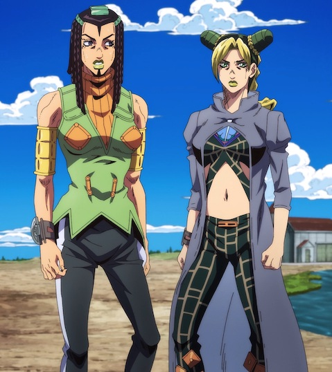
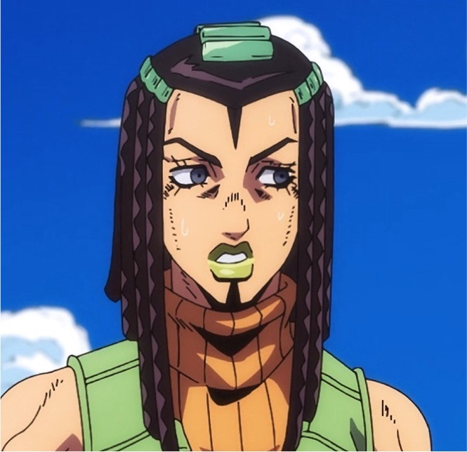
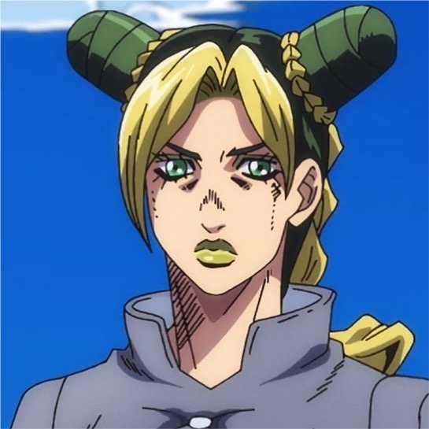
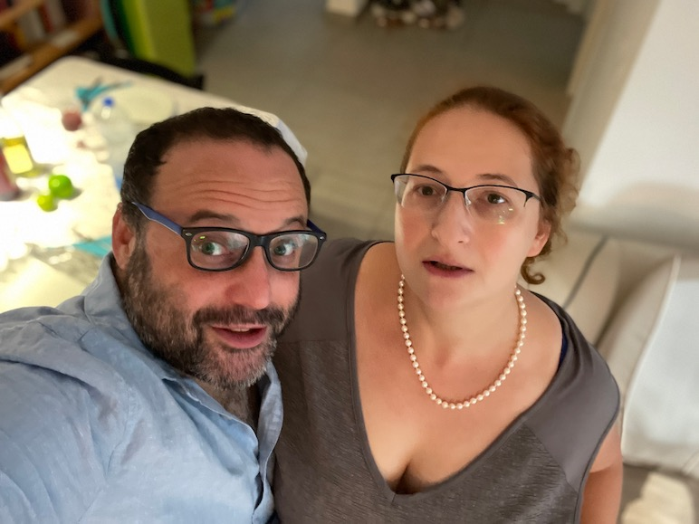
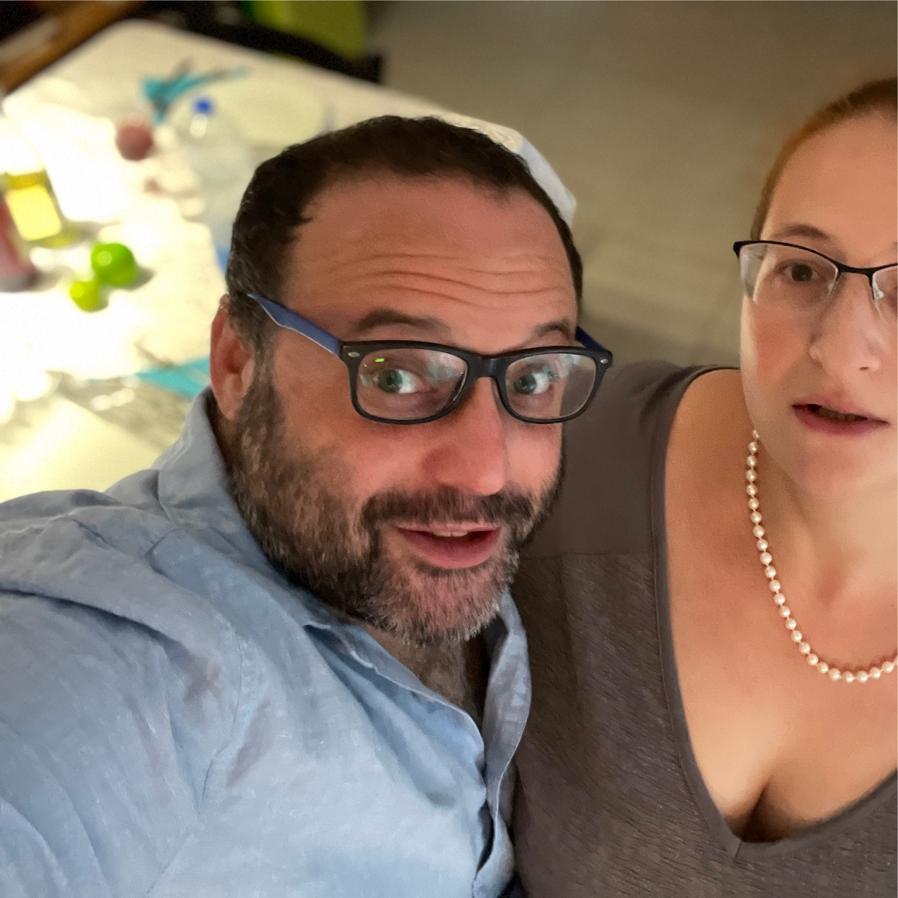
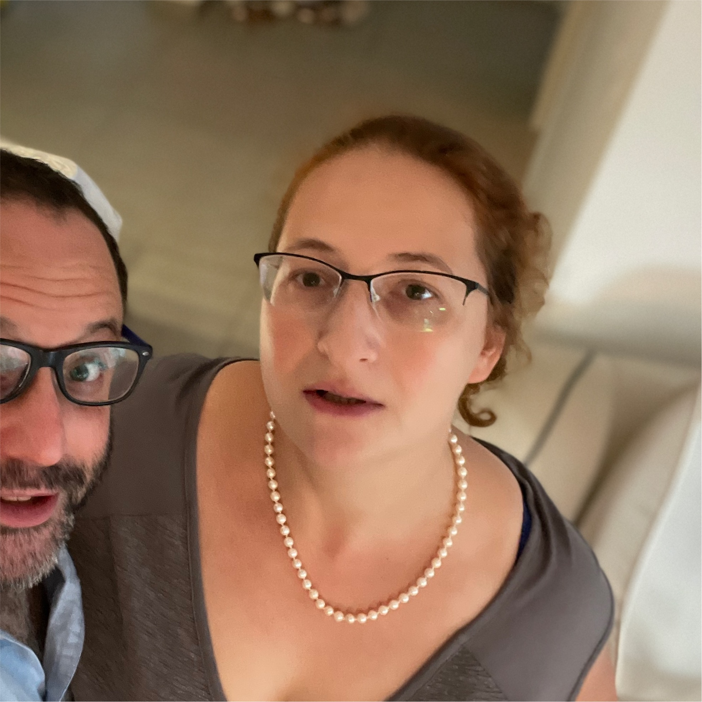

# Head Cropper

A basic macOS App which lets you select an image or a folder with images and it will crop out all detected heads

There are plenty of scripts out there which crop out faces, or crops and generate FFHQ aligned faces but I could not find something simple which would just go over a folder of images and crop out whole (unaligned) heads, with plenty of margin. So I made this.

## Example 1

  

## Example 2

  

